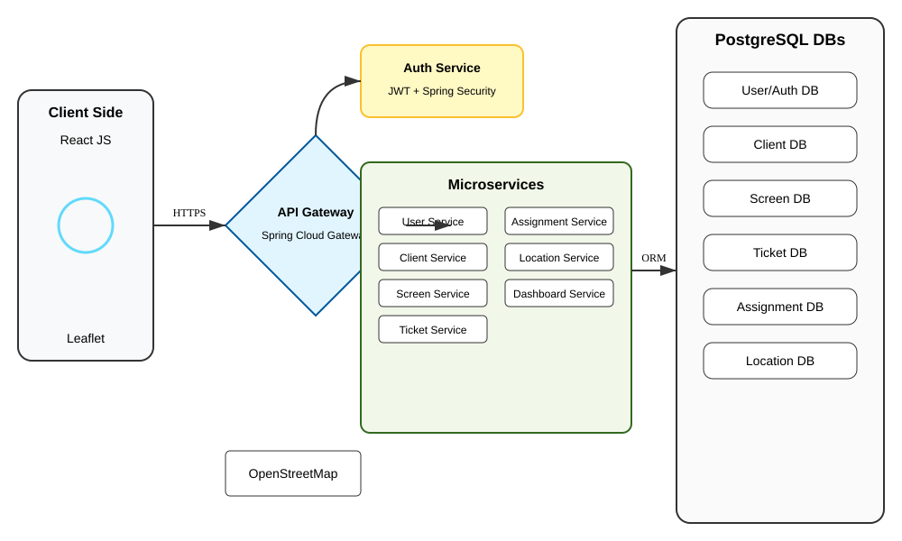

# SGEPD - Système de Gestion d'Écrans Publicitaires Digitaux

## Architecture du Projet

## Microservices Implémentés

- **auth-service** (Port 8080) : Authentification et JWT.
- **user-service** (Port 8081) : Gestion des utilisateurs.
- **screen-service** (Port 8082) : Gestion du parc d'écrans.
- **ticket-service** (Port 8083) : Maintenance et tickets d'intervention.
- **client-service** (Port 8084) : Gestion des annonceurs (CRUD).

## Technologies
- Java 17 / Spring Boot 3
- PostgreSQL
- Spring Cloud Gateway (API Gateway)
- JWT (JSON Web Tokens)
- React JS (Frontend)
